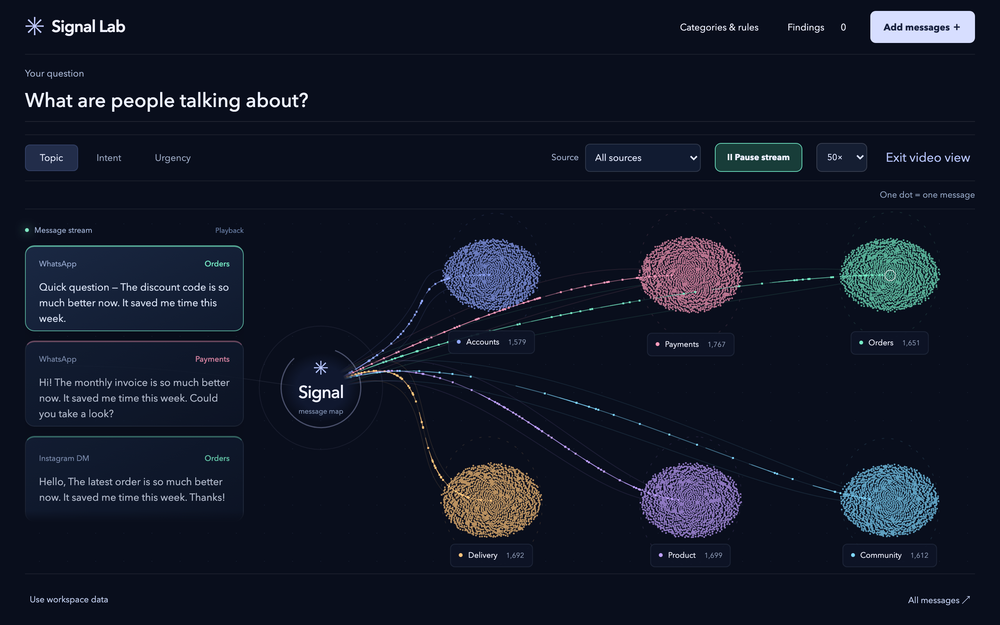
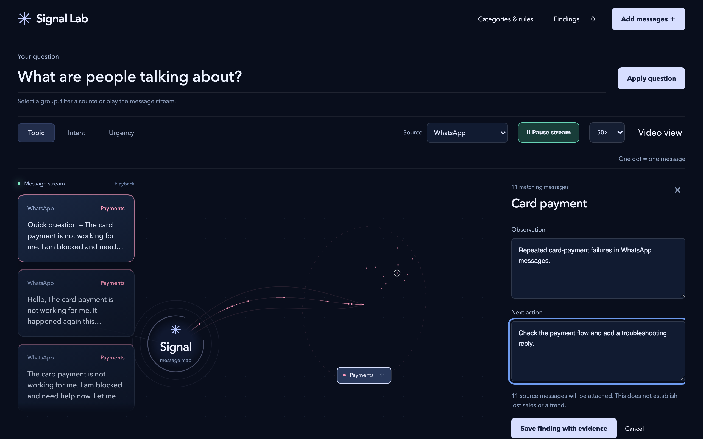

# Signal Lab

Turn a wall of messages into groups you can explore and findings you can act on. Signal Lab combines an animated message map, configurable classification, source evidence and an optional Jev connection.

## Install

Once this entry is merged into the Chatfuel catalog:

```sh
npx @chatfuel/wizard --app signal-lab
```

Modules: `auth` (accounts and access), `channels` (connected messaging channels), and `livechat` (conversation queries). The Signal Lab workspace and analysis adapter ship in this app's overlay. No extra npm dependencies are added.

For a local review, place this folder at `apps/signal-lab` in a catalog checkout and follow the [local-catalog workflow](../../docs/authoring.md#test-the-app-end-to-end). After Wizard applies the overlay, follow [playbook.md](playbook.md):

```sh
node scripts/install-signal-lab.mjs
npm run check
npm run build
npm run dev
```

Open `/signal-lab`. The installer registers the module, navigation, read-only inbox operations and server handlers. Running it again is safe. This catalog entry is prepared for review and has not been published.

## From messages to a next step

1. Start with the included message map, or import CSV/JSON and pasted text.
2. Filter by source and group. Open messages to inspect the wording and conversation context.
3. Find repeated phrases, review the matching messages and exclude irrelevant evidence.
4. Save an observation and a next action with the source messages attached. Export findings as JSON.

The map responds to filters and category changes. Video view shows a vertical stream of readable message cards alongside moving clusters. Playback speed controls the visualization.

## Your categories and analysis

Edit category definitions, questions, business context, scoring and review thresholds. Imported messages remain pending until analysis is requested. Optional analysis requires a server-only `TYPESAFE_API_KEY`, SDK authentication and the existing Chatfuel token proxy. Every run asks for confirmation before selected messages, context and rules are sent to TypeSafe/Jev.

The connected-inbox importer previews incoming text from up to ten recent conversations and twenty messages per conversation in the selected bot. It preserves available source IDs, timestamps and preceding context. It is read-only: it does not send replies or change read status.

## Included data and boundaries

The opening map contains generated scenarios with scripted labels and needs no provider key. A separate workbench sample contains recorded real Jev responses to invented messages. Neither is presented as customer history or a benchmark. Repeated-phrase suggestions use local wording analysis; new semantic classifications require a separate analysis run.

Imported messages, new results and findings stay in the tab. Export them before closing. Full-history sync and a standalone Instagram comment crawler are not included. Configure and verify the target account's authentication and credentials before production use.

## Preview




